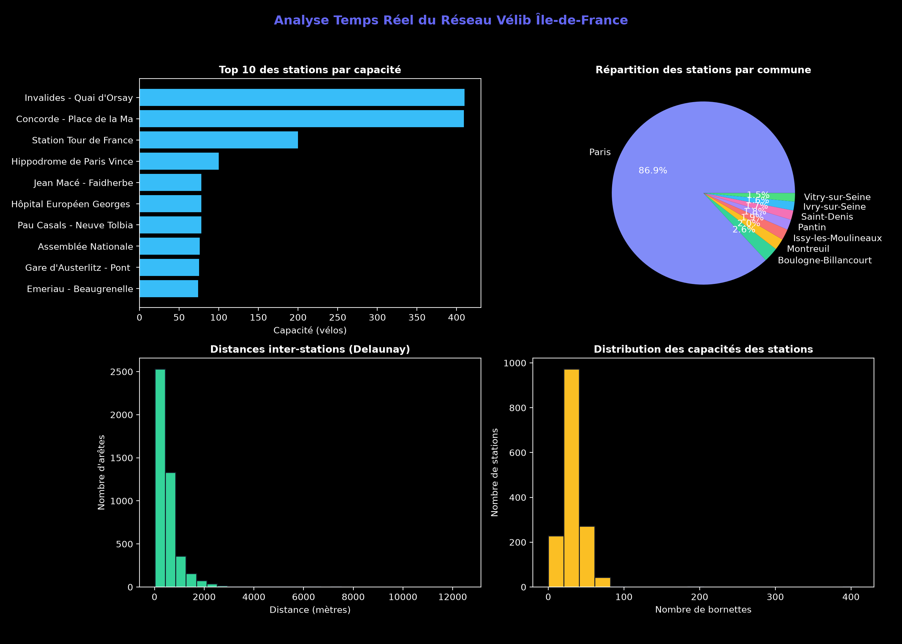

<div align="center">

  # 🚲 Optimisation & Dashboard Analytique du Réseau Vélib (1 518 Stations - Île-de-France)

  [](https://python.org)
  [](#)
  [](#)
  [](#)
  [](#)
  [](#)

  <p align="center">
    <b>Étude algorithmique, spatialisation géodésique, calcul d'itinéraires (Dijkstra) et dashboard d'analyse statistique sur les 1 518 stations Vélib métropolitaines réparties sur 69 communes d'Île-de-France.</b>
  </p>

---

</div>

## 📊 Tableau de Bord Statistiques & Visualisation



---

## 📌 Présentation du Projet

Ce projet associe **théorie des graphes**, **analyse de données spatiales** et **visualisation interactive** pour optimiser le réseau Vélib Métropole (1 518 stations sur Paris et la région Île-de-France).

### 📐 Approche Algorithmique & Data

1. **Extraction OpenData Temps Réel (`Data.Gouv.fr`)** : 1 518 stations géolocalisées avec capacité de bornettes et communes.
2. **Triangulation de Delaunay (`SciPy`)** : Réduction de la complexité spatiale des connexions de $O(V^2)$ à un graphe de **4 536 arêtes candidates**.
3. **Calculateur d'Itinéraire Optimal (Dijkstra)** : Calcul du plus court chemin en $O((E+V) \log V)$ entre deux stations sélectionnées avec estimation du temps à vélo.
4. **Arbre Couvrant Minimum (MST)** : 
   - **Algorithme de Kruskal** (*Union-Find*, $O(E \log E)$).
   - **Algorithme de Prim** (*Min-Heap*, $O(E \log V)$).
5. **Dashboard Web Interactif (Folium, Leaflet, Chart.js)** :
   - Cartes KPI dynamiques (Stations, Vélos, Distances MST, Communes).
   - Graphiques de répartition (Bar charts & Donut charts).
   - Sélecteur interactif de trajet de départ / arrivée.

---

## ⚡ Résultats & Performances

| Métrique | Valeur |
|---|---|
| **Nombre de Stations** | **1 518 stations** |
| **Capacité Totale de Vélos** | **49 060 bornettes / vélos** |
| **Couverture Géographique** | **69 communes d'Île-de-France** |
| **Longueur Totale du Réseau Optimisé (MST)** | **502.09 km** |
| **Temps d'exécution (Kruskal)** | **4.42 ms** |
| **Temps d'exécution (Prim)** | **5.29 ms** |
| **Calcul d'Itinéraire (Dijkstra)** | **4.02 ms** |

---

## 🚀 Lancement Rapide

```bash
# 1. Cloner le projet
git clone https://github.com/misbaou672/optimisation-velib.git
cd optimisation-velib

# 2. Installer les dépendances
pip install scipy pandas numpy folium requests matplotlib

# 3. Exécuter l'analyse et générer les graphiques / carte
python optimisation_velib.py
```

L'exécution génère l'image dashboard `data/graphiques_velib.png` et l'application carte web `carte_velib_optimisee.html`.

---

<div align="center">
  <sub>Développé par <a href="https://github.com/misbaou672">Misbaou DIALLO</a></sub>
</div>
