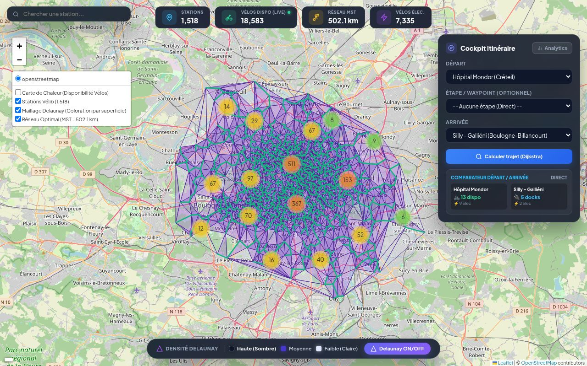
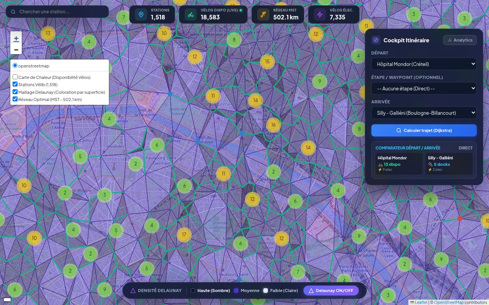

# Velib-Optim — Optimisation Algorithmique Réseau Vélib

Ce projet d'analyse spatiale et d'optimisation algorithmique a pour but d'analyser et de restructurer le réseau de stations Vélib pour maximiser l'efficacité de distribution et minimiser les coûts d'infrastructure électrique.

## 📸 Aperçu de l'interface et des graphes

| Cartographie Interactive | Analyse Spatiale (Zoom) |
| :---: | :---: |
|  |  |

## 🚀 Fonctionnalités principales

- **Analyse Spatiale et Triangulation** : Modélisation des stations avec triangulation de Delaunay.
- **Optimisation de graphes** : Déploiement des algorithmes de Kruskal et Prim pour trouver l'Arbre Couvrant de Poids Minimum (MST).
- **Rendu Cartographique** : Visualisation interactive des stations et des chemins optimisés sur carte (Folium).
- **Performances algorithmiques** : Utilisation intensive de structures de données optimisées sous Python (NumPy, SciPy).

## 🛠️ Stack & Technologies

- **Langage** : Python 3
- **Calcul scientifique** : NumPy, SciPy
- **Data Visualisation** : Folium, Matplotlib
- **Théorie des graphes** : Algorithmes de Prim, Kruskal, Dijkstra

---
*Développé par Misbaou DIALLO.*
